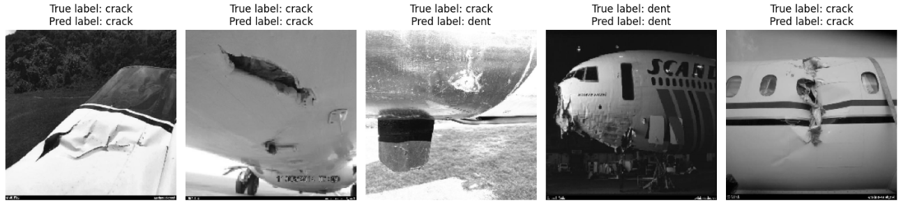

# VGG16-BLIP-Damage-Detection

### Project overview
This project demonstrates the power of combining different pre-trained models, namely
a Convolutional neural network (VGG16 trained on the ImageNet visual database) and the
BLIP transformer. First we classify an image of a damaged aircraft into one of two classes,
a dent or a crack, and then provide a caption and summary of the damage in natural language.

## How it works

### Classification:
For classification, I had to freeze the convolutional and pooling layers (the base)
of the VGG16 model and remove the top. I then built a custom top that was appropriate
for binary classification. Once the new model was trained, I created a custom function
`test_model_on_image` in the class `visualization_utils_images` that displays the image(s),
the predicted label, and the true label of any number of images the user wants to test.
An example output for 5 images was the following:

***

### Captioning & Summarization:

After the image has been classified, it can then be passed into the Blip layer. In this layer, 
the image is converted to RGB format, the task (caption and summary) is decoded to create a prompt,
before being passed into the processor of the BLIP model, which returns the processed inputs to pass into
the BLIP model. The outputs from the transformer are then decoded before finally being returned.
To visualize the captioning and summarization, I create a custom function 
`plot_image_with_caption_and_summary` in the class `visualization_utils_images` which takes
an image file path, and an instance of the Blip layer and returns the image with the caption
and summary as the title. An example output for an image was the following:

$\hspace{7cm}$ 

## Technologies Used

* **Python**
* **TensorFlow / Keras:** For the VGG16 model and custom layer.
* **Hugging Face hub:** Specifically the transformer library for the BLIP model & processor.
* **Pillow (PIL):** For image manipulation.
* **NumPy:** For decoding tensors.
* **Matplotlib:** For plotting and visualization.
* **Jupyter Notebook:** For experimentation and presentation.

## How to run
Follow these steps to run this project on your machine

- **Clone the repository:**

Clone the repository to your machine: git clone https://github.com/Daniel-Lawless/VGG16-BLIP-Damage-Detection.git 

Move into folder: cd VGG16-BLIP-Damage-Detection

- **Create & activate virtual environment:**

Create virtual environment: py -m venv venv

Activate virtual environment: .venv\Scripts\activate (For windows) source venv/bin/activate (for macOS or Linux)

- **Install Dependencies:**

Install the required packages/frameworks: pip install -r requirements.txt

- **Run the project:**

You can now run the main project: jupyter notebook aircraft_damage_classification_and_captioning.ipynb
